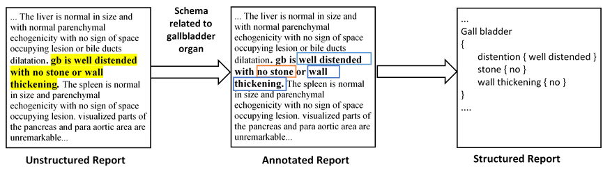

# ReportQL — Application of Deep Learning in Generating Structured Radiology Reports: A Transformer-Based Technique

*[Seyed Ali Reza Moezzi](https://scholar.google.com/citations?hl=en&user=JIZgcjAAAAAJ)*,
*[Abdolrahman Ghaedi]()*,
*[Mojdeh Rahmanian](https://scholar.google.com/citations?user=2ZtVfnUAAAAJ)*,
*[Seyedeh Zahra Mousavi](https://www.researchgate.net/scientific-contributions/Seyedeh-Zahra-Mousavi-2176375936)*,
*[Ashkan Sami](https://scholar.google.com/citations?user=zIh9AvIAAAAJ)*
<html>
<div><sub><sup>*Submitted: 16 November 2021*</sup></sub></div>
<div><sub><sup>*Revised: 20 June 2022*</sup></sub></div>
<sub><sup>*Accepted: 27 July 2022*</sup></sub>
</html>

[[paper](https://link.springer.com/article/10.1007/s10278-022-00692-x)] [[arXiv](https://arxiv.org/abs/2209.12177)] [[dataset](https://www.kaggle.com/datasets/sarme77/reportql)] [[project page](https://alimoezzi.github.io/ReportQL/)]

## Introduction

This repository is code release for **Application of Deep Learning in Generating Structured Radiology Reports: A Transformer-Based Technique**

<p align="center">  </p>

Since radiology reports needed for clinical practice and research are written and stored in free-text narrations, extraction of relative information for further analysis is difficult. In these circumstances, natural language processing (NLP) techniques can facilitate automatic information extraction and transformation of free-text formats to structured data. In recent years, deep learning (DL)-based models have been adapted for NLP experiments with promising results. Despite the significant potential of DL models based on artificial neural networks (ANN) and convolutional neural networks (CNN), the models face some limitations to implement in clinical practice. Transformers, another new DL architecture, have been increasingly applied to improve the process. Therefore, in this study, we propose a transformer-based fine-grained named entity recognition (NER) architecture for clinical information extraction. We collected 88 abdominopelvic sonography reports in free-text formats and annotated them based on our developed information schema. The text-to-text transfer transformer model (T5) and Scifive, a pre-trained domain-specific adaptation of the T5 model, were applied for fine-tuning to extract entities and relations and transform the input into a structured format. Our transformer-based model in this study outperformed previously applied approaches such as ANN and CNN models based on ROUGE-1, ROUGE-2, ROUGE-L, and BLEU scores of 0.816, 0.668, 0.528, and 0.743, respectively, while providing an interpretable structured report.

## Dataset

Our annotated [dataset](https://doi.org/10.5281/zenodo.7072374) used in the paper is hosted in this repository and in [Kaggle Datasets](https://www.kaggle.com/datasets/sarme77/reportql).

The data is structured as follows:

```
data/
├── trialReport
│   └── ReportQL
│       ├── Schemas
│       │   └── organs
│       │       └── simpleSchema.json
│       └── dataset
│           ├── test.csv
│           ├── train_orig.csv
│           └── training.csv
```

The `train_orig.csv` is our original training set. You can find our synthetic dataset and test set in `training.csv` and `test.csv` file.

Information schema used for annotating reports can be found in `simpleSchema.json`

## Setup

Setting up for this project involves installing dependencies.

### Setting up environments and Installing dependencies

```bash
virtualenv .venv
source .venv/bin/activate
```

### Installing dependencies

To install all the dependencies, please run the following:

```bash
pip install -r requirements.txt
```

### Fine-tuning

To start fine-tuning language model, run:

```bash
python script/fit.py
```

### Testing

For getting test results on our test set, run:

```bash
python script/test.py
```

### Inference

We prepared [a jupyter notebook](notebooks/predict_reportql.ipynb) for Inference.

## Fine-tuned Model

Our fine-tuned ReportQL weights can be accessed on 🤗 HuggingFace.

* ReportQL: [base](https://huggingface.co/sarme/ReportQL-base)

## License

Please see the [LICENSE](LICENSE) file for details.

## Citation

If you find our work useful in your research, please consider citing us:

```
@article{moezzi2022application,
  title={Application of Deep Learning in Generating Structured Radiology Reports: A Transformer-Based Technique},
  author={Moezzi, Seyed Ali Reza and Ghaedi, Abdolrahman and Rahmanian, Mojdeh and Mousavi, Seyedeh Zahra and Sami, Ashkan},
  journal={Journal of Digital Imaging},
  pages={1--11},
  year={2022},
  publisher={Springer}
}
```
